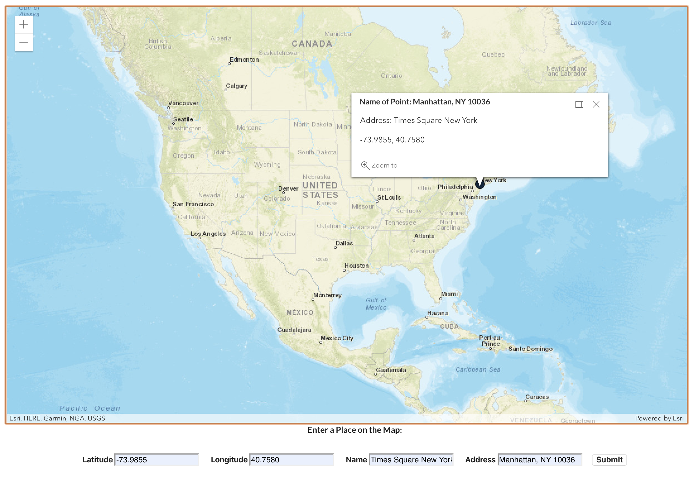

This is a map that I created with the ArcGIS API for JavaScript. It is created with ReactJS and allows the user to plot points onto the graph using its longitude and latitude. There is also a popup template that renders the name of the point, its address and its latitude and longitude upon click.
